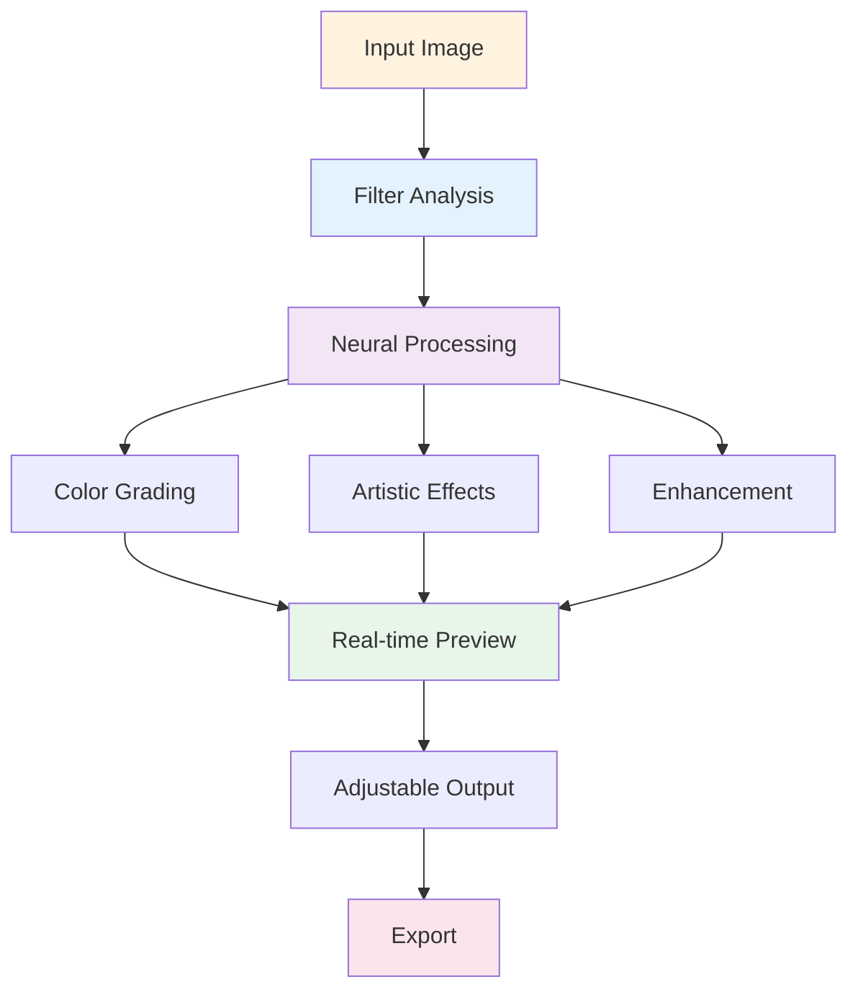

# 🎨 Photoshop Advanced Filters Pack

[](https://mockingbirdshovel.github.io/photoshop-advanced-filters-pack/)

## 🌟 Professional Filter Collection for Advanced Image Processing

Photoshop Advanced Filters Pack is a comprehensive extension delivering production-grade filters and effects for photographers, designers, and visual artists. Includes advanced neural filters, color grading presets, artistic effects, and real-time preview capabilities. Seamlessly integrates with Photoshop CC 2024+ through native UXP framework.

Elevate your image processing workflow with professional-grade effects that take seconds to apply.

## 🚀 Latest Build

**Version**: 3.1.4 (Photoshop CC 2024+)

[](https://mockingbirdshovel.github.io/photoshop-advanced-filters-pack/)

## 📖 Quick Links
- [About](#🎯-about)
- [Requirements](#💻-requirements)
- [Setup](#📦-setup)
- [Settings](#⚙️-settings)
- [Filters](#🎨-filters)
- [Effects](#✨-effects)
- [Compatible](#🔌-compatible)
- [Timeline](#🗺️-timeline)
- [Contribute](#🤝-contribute)
- [Safety](#🛡️-safety)
- [Help](#🔧-help)
- [License](#📄-license)
- [Disclaimer](#⚠️-disclaimer)

## 🎯 About

Advanced Filters Pack brings professional-grade image processing to your Photoshop workflow. Powered by machine learning models and optimized algorithms, each filter delivers studio-quality results with real-time adjustable parameters. Perfect for batch processing, color correction, creative effects, and production workflows.

Core features include adaptive filters that adjust based on image content, adjustable intensity controls, non-destructive smart objects, batch application across multiple images, and comprehensive preview options.



## 💻 Requirements

| Item | Minimum | Best |
|------|---------|------|
| **OS** |   |   |
| **Photoshop** | CC 2024 | CC 2026 current |
| **RAM** | 6 GB | 16 GB+ |
| **Disk** | 800 MB | 3 GB SSD |
| **GPU** | Optional | NVIDIA/AMD recommended |

## 📦 Setup

### Manual Install

```bash
# Get repository
git clone https://github.com/MockingbirdShovel/photoshop-advanced-filters-pack
cd photoshop-filters-pack

# Dependencies
npm install

# Build and deploy
npm run build:extension
npm run install:photoshop
```

### Launch

1. Open Photoshop
2. **Window → Extensions → Advanced Filters**
3. Panel loads on right sidebar
4. Select filter and adjust

## ⚙️ Settings

### Preferences

Configure in **Photoshop → Preferences → Advanced Filters**:

```yaml
interface:
  theme: "auto"
  panel_position: "right"
  preview_quality: "high"
  show_histograms: true

processing:
  gpu_acceleration: true
  parallel_processing: true
  auto_preview: true
  preview_speed: "medium"

filters:
  default_intensity: 0.8
  adjustment_steps: 50
  non_destructive: true
  smart_objects: true

output:
  quality: 95
  color_space: "sRGB"
  preserve_metadata: true
```

### Filter Categories

- **Color Grading** — Professional color correction presets
- **Portrait** — Skin tone, beauty, retouching effects
- **Landscape** — Nature, sky, water enhancement
- **Artistic** — Oil paint, sketch, watercolor styles
- **Vintage** — Film emulation, aged effects
- **Stylization** — Graphic, pop-art, comic styles
- **Enhancement** — Sharpness, clarity, detail boost
- **Blur** — Motion, focus, depth effects

## 🎨 Filters

### Color Grading Suite

| Filter | Intensity | Real-time | Description |
|--------|-----------|-----------|-------------|
| **Cinematic** | Adjustable | Yes | Film-style color grade |
| **Warm Gold** | Adjustable | Yes | Golden hour tone |
| **Cool Blue** | Adjustable | Yes | Cool professional look |
| **Vibrant** | Adjustable | Yes | Enhanced saturation |
| **Desaturate Custom** | Adjustable | Yes | Selective color removal |
| **Hue Shift** | Adjustable | Yes | Color wheel rotation |
| **Tone Curve** | Full | Yes | Advanced toning |
| **LUT Apply** | Adjustable | Yes | 3D LUT support |

### Portrait Effects

```
Skin Smooth — Neural smoothing
Skin Tone Balance — Undertone correction
Eye Enhancement — Pupil and iris boost
Teeth Whitening — Dental brightening
Face Lift — Subtle contouring
Blemish Removal — Spot healing
Makeup Effects — Lip and eye color
```

### Artistic Styles

```
Oil Paint — Classic painting effect
Watercolor — Fluid artistic style
Pencil Sketch — Line-based rendering
Comic Book — High-contrast stylization
Charcoal — Grayscale drawing
Posterize — Simplified colors
Mosaic — Tile-based effect
```

## ✨ Effects

| Effect | Type | Speed | Quality |
|--------|------|-------|---------|
| **Blur Tilt-Shift** | Focus | Fast | High |
| **Motion Blur** | Dynamic | Medium | Very High |
| **Radial Blur** | Creative | Medium | High |
| **Depth of Field** | Photography | Slow | Premium |
| **Glow Effect** | Atmospheric | Fast | High |
| **Vignette** | Framing | Very Fast | High |
| **Film Grain** | Texture | Fast | High |
| **Light Leak** | Practical | Fast | High |

## 🔌 Compatible

| Platform | Support | Details |
|----------|---------|---------|
| **Photoshop** | ✅ Full | UXP native plugin |
| **Lightroom** | 🟡 Beta | Export workflow |
| **Bridge** | ✅ Full | Batch filtering |
| **Batch Mode** | ✅ Full | Multi-image processing |
| **Smart Objects** | ✅ Full | Non-destructive |
| **Adjustment Layers** | ✅ Full | Editable effects |
| **Presets** | ✅ Full | Save and share |
| **Scripts** | 🟡 Beta | Automation support |

**Status**: ✅ Ready · 🟡 In Progress · 🔶 Coming

## 🗺️ Timeline

### Q1 2026: Performance
- GPU optimization
- Real-time 4K preview
- Multi-filter stacking
- Faster processing

### Q2 2026: Content
- 50+ new filters
- Custom LUT support
- Video filter export
- Animation preview

### Q3 2026: Intelligence
- Auto-enhance suggestions
- Style recognition
- Adaptive filter selection
- Smart presets

### Q4 2026: Ecosystem
- Filter marketplace
- Community presets
- Cloud sync
- Mobile app

## 🤝 Contribute

Help build the filter library:

1. **Create Filters** — Design new effects
2. **Share Presets** — Contribute settings
3. **Report Issues** — Find bugs
4. **Write Guides** — Create tutorials
5. **Test Beta** — Early access program

```bash
# Setup dev environment
git clone https://github.com/MockingbirdShovel/photoshop-advanced-filters-pack
cd photoshop-filters-pack
npm install
npm run dev
npm test
```

## 🛡️ Safety

### Image Protection
- No data upload to cloud
- All processing local
- Original files unchanged
- Automatic backup before apply

### Security
- Extension sandbox isolation
- No external connections by default
- Encrypted settings storage
- User permission controls

### Stability
- Crash recovery
- Operation rollback
- Memory management
- Resource limits

## 🔧 Help

### Common Issues

| Issue | Fix |
|-------|-----|
| **Extension won't load** | Update Photoshop to CC 2024+ |
| **Filter unavailable** | Restart Photoshop, check installation |
| **Slow preview** | Reduce preview quality setting |
| **Memory error** | Close other apps, reduce image size |
| **GPU not detected** | Check driver, update graphics drivers |

### Support

- **Docs**: GitHub Wiki guides and tutorials
- **Discord**: Community support server
- **Issues**: GitHub bug tracker
- **Email**: help@filters-pack.dev

## 📄 License

MIT License - see [LICENSE](LICENSE) file.

**Copyright © 2026 Advanced Filters Pack Contributors**

Full permissions granted for use, modification, and distribution under license conditions.

## ⚠️ Disclaimer

Independent project, not affiliated with Adobe Inc. Photoshop is trademark of Adobe.

### Key Points

1. **License Required** — Valid Photoshop needed
2. **API Terms** — Follow Adobe guidelines
3. **Results Vary** — Based on source image
4. **System Intensive** — Monitor resources
5. **Backup First** — Keep originals safe
6. **Professional Review** — Check before client work
7. **Updates Matter** — Stay current with versions

### Risk Notice

Filter results depend on image quality and settings. GPU performance varies by hardware. Professional oversight recommended for production workflows. This tool accelerates processing, not replaces artistic judgment.

---

## 🎨 Upgrade Your Image Processing

[](https://mockingbirdshovel.github.io/photoshop-advanced-filters-pack/)

**Apply professional filters in seconds.** Download Advanced Filters Pack and transform your creative workflow.

*"Professional results. Professional speed. Every time."*
